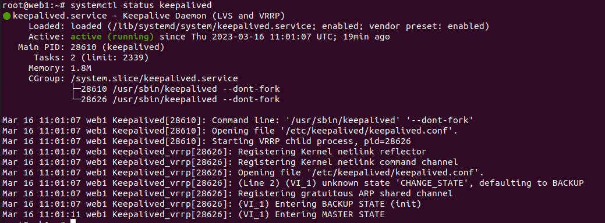
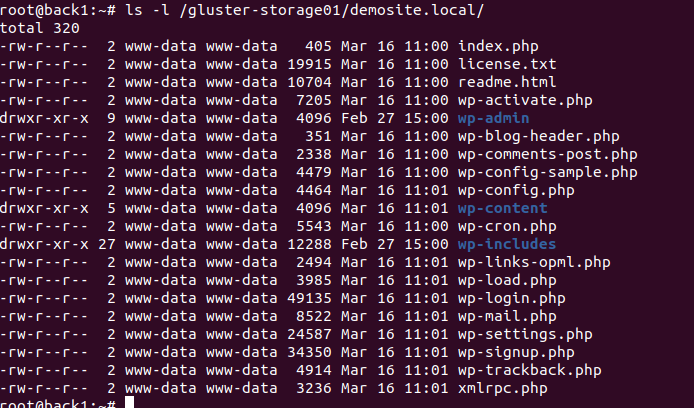
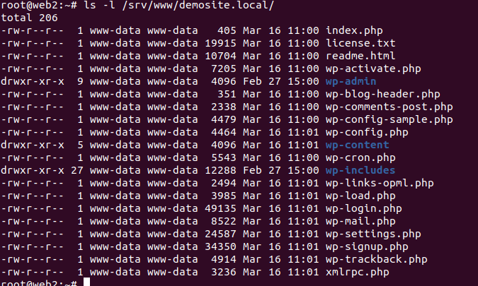

This project deploy 5 VMs ubuntu-server 20.04 on PVE.
2 VMs frontend stateless servers with nginx web server.
2 VMs backend with GlusterFS cluster, which include statefull content for web servers.
1 VM mariadb-server, worpdpress database here.

To start deploy run:
1. terraform apply
2. ansible-playbook site.yml

Scheme:

Check keepalived on web VMs:

web1:

web2:

Check glusterfs volume on backends nodes:

Check glusterfs client on web servers:

web1:

web2:

Check content of /srv/www/demosite.local

Check http://demosite.local

